# StreamingPlatform: Where Every Frame Tells a Story 🎬✨

Welcome to **StreamingPlatform**, a dynamic video streaming platform where every frame truly tells a story. Stream your favorite series, films, and documentaries with unmatched visual and audio quality, right at your fingertips. Built with the powerful **MERN (MongoDB, Express.js, React, Node.js)** stack, this project showcases robust video management, interactive user engagement features, and a commitment to modern UI/UX principles, evolving through distinct versions.

---

## 🚀 Live Demos

Experience StreamingPlatform in action! Dive into the live deployments:

* **Version 2 (Latest - Frontend with Playlists & Subscriptions):**
    🌐 [https://streaming-platform-version-2.vercel.app/](https://streaming-platform-version-2.vercel.app/) 🚀

* **Version 1 (Initial Core Features):**
    🌐 [https://streamingplatform-frontend.onrender.com/](https://streamingplatform-frontend.onrender.com/) ☁️

---

## ✨ Features

StreamingPlatform has evolved significantly. Here's a breakdown of the functionalities across its versions:

### Version 1: Core Streaming Capabilities

* 🔐 **Secure User Authentication:** Enjoy robust user registration and login, ensuring a safe experience.
* 📈 **Dashboard Functionality:** Get insights into your channel's performance with comprehensive statistics, including total views, likes, and uploaded videos.
* 📤 **Dynamic Video Upload:** Easily upload your video content to the platform with secure handling.
* 📺 **Seamless Video Viewing:** Watch videos with a smooth, responsive player for an uninterrupted experience.
* 🗣️ **Interactive Comments System:** Engage directly with content by adding and viewing comments.
* ❤️‍🔥 **Like/Unlike Functionality:** Express your appreciation for videos with a simple click.
* ⭐ **Liked Videos Dashboard:** Quickly access all the videos you've liked from a dedicated section.
* 📝 **Video Publishing/Unpublishing:** Maintain full control over your content's visibility.

### Version 2: Enhanced Engagement & Refined Experience

Building upon Version 1's foundation, this iteration introduces significant enhancements:

* 🎶 **Personalized Playlists:** Create and manage custom video playlists to organize content for your audience or personal viewing.
    * Easily add or remove videos from your playlists.
* ✅ **Channel Subscriptions:** Follow your favorite channels to stay updated with their latest uploads.
    * Effortlessly view and manage your subscriptions.
* 🌟 **Redefined UI/UX:** Experience a completely revamped user interface designed for intuitive navigation and an aesthetically pleasing, modern feel.
    * Improved responsiveness across all devices.
    * Enhanced visual feedback and fluid animations for a smoother user journey.

---

## 🛠️ Tech Stack

StreamingPlatform leverages a powerful combination of technologies to deliver a robust and scalable streaming experience.

| Category            | Technologies                                                                                               |
| :------------------ | :--------------------------------------------------------------------------------------------------------- |
| **Frontend** 💻   | **React.js** (Hooks), **Material-UI** (MUI), **Framer Motion**, **Axios**, **Mux Player**, **Vite**, HTML5 / CSS3 / JavaScript |
| **Backend** ⚙️    | **Node.js**, **Express.js**, **MongoDB**, **Mongoose**, **JSON Web Tokens** (JWT), **Bcrypt.js** |
| **Cloud & Hosting** 🌐 | **Vercel** (Frontend V2), **Render** (Frontend V1 & Backend), **Mux** (Video Streaming API & CDN)          |

---

## 📸 Screenshots

Witness the user interface and key features of StreamingPlatform across its versions.

### Version 2 Screenshots ✨

**Redefined Landing Page:**
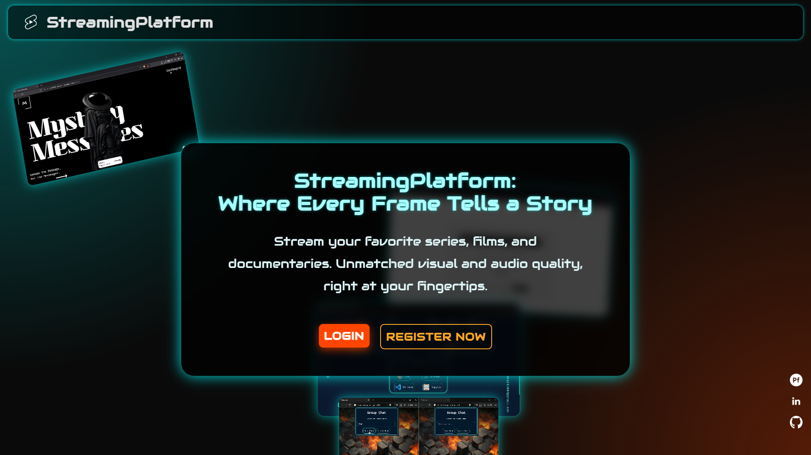
*The sleek, redesigned landing page with improved navigation and aesthetics.*

**Home Page:**
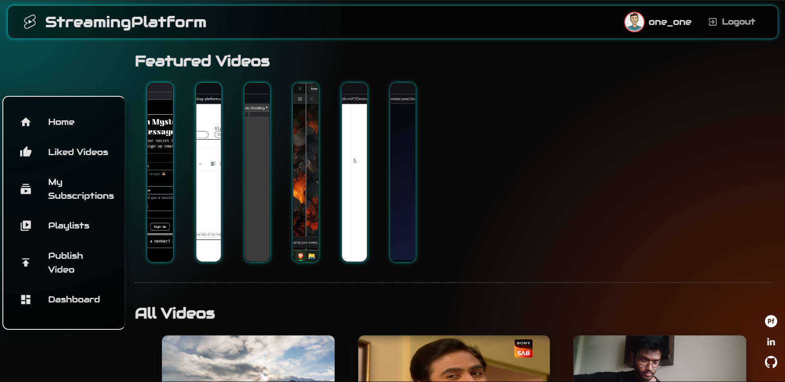
*The main home feed showcasing various video content.*

**My Subscriptions Page:**
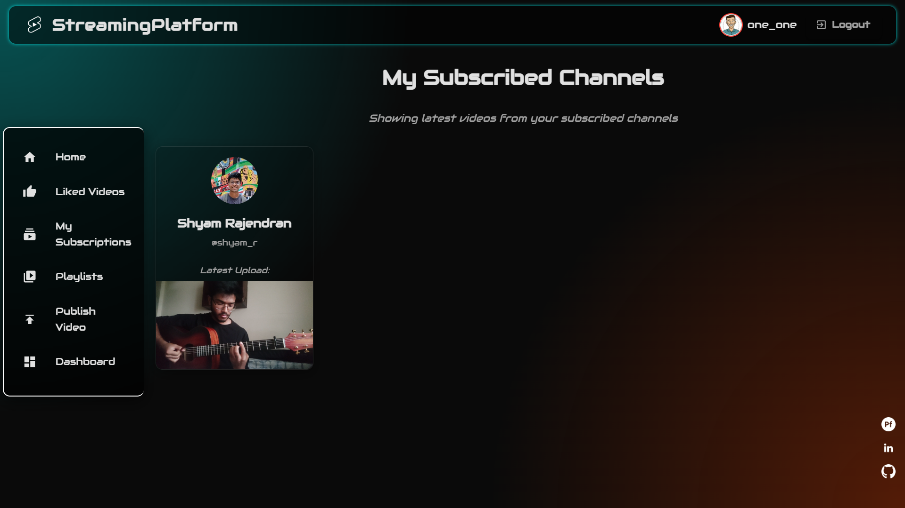
*View and manage your channel subscriptions effortlessly.*

**My Playlists Page:**
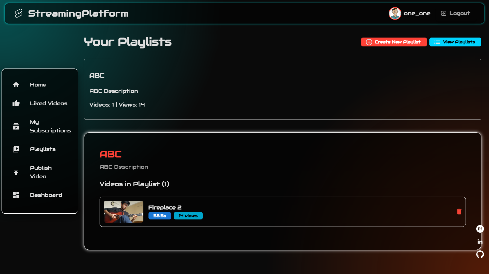
*Organize and access your personalized video collections.*

**Upload Video Page:**
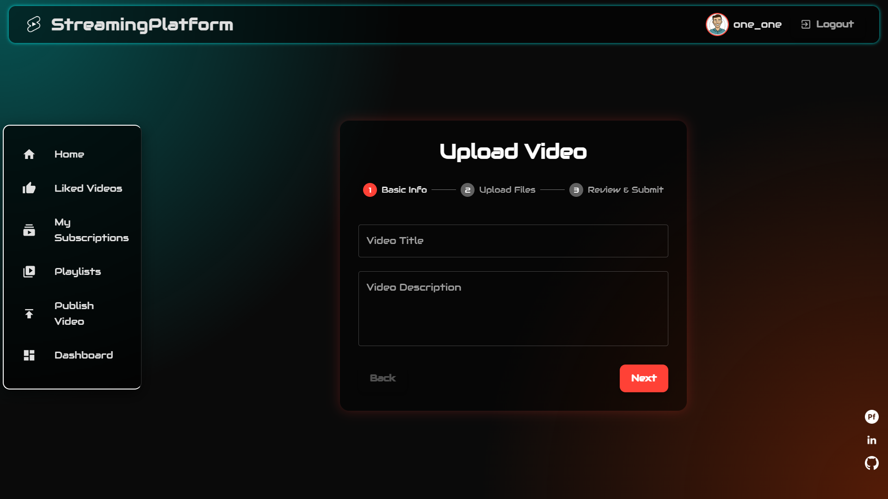
*The intuitive interface for uploading new video content to your channel.*

**Dashboard:**
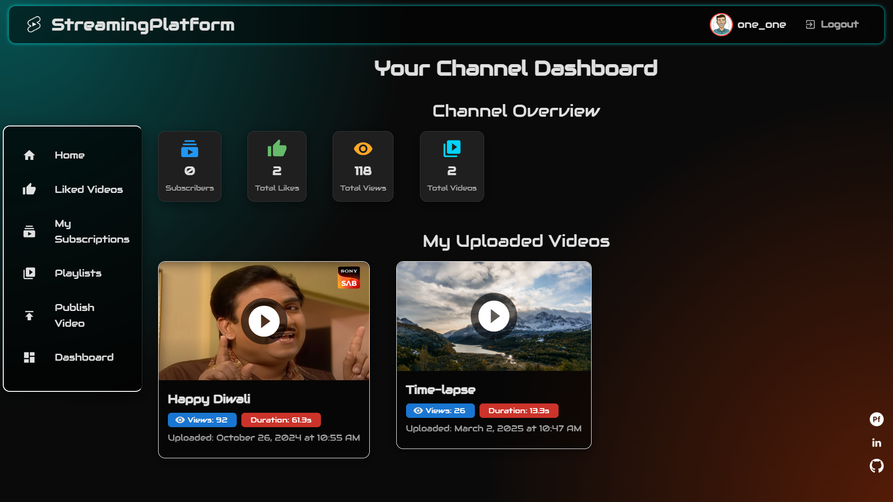
*A comprehensive overview of your channel's performance and video analytics.*

**Mobile View:**

  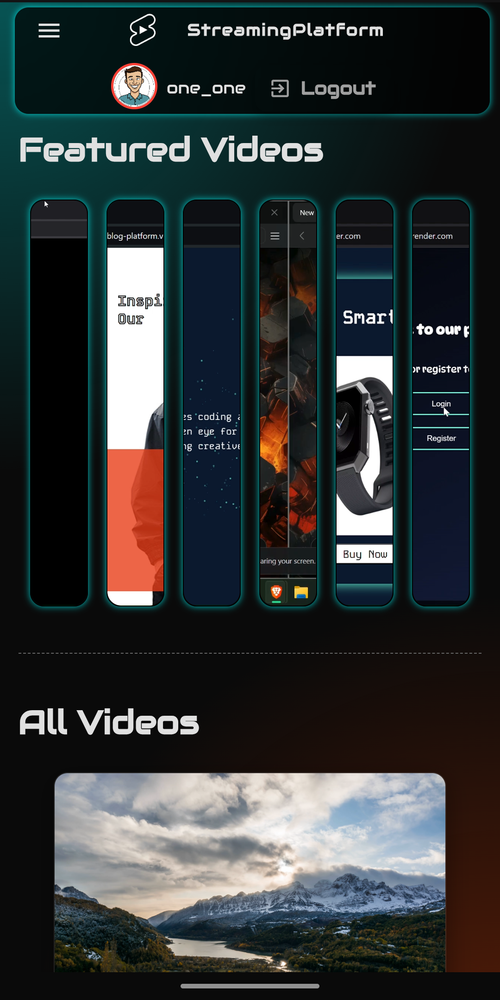
  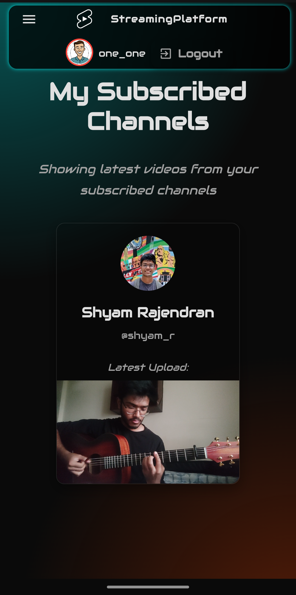
  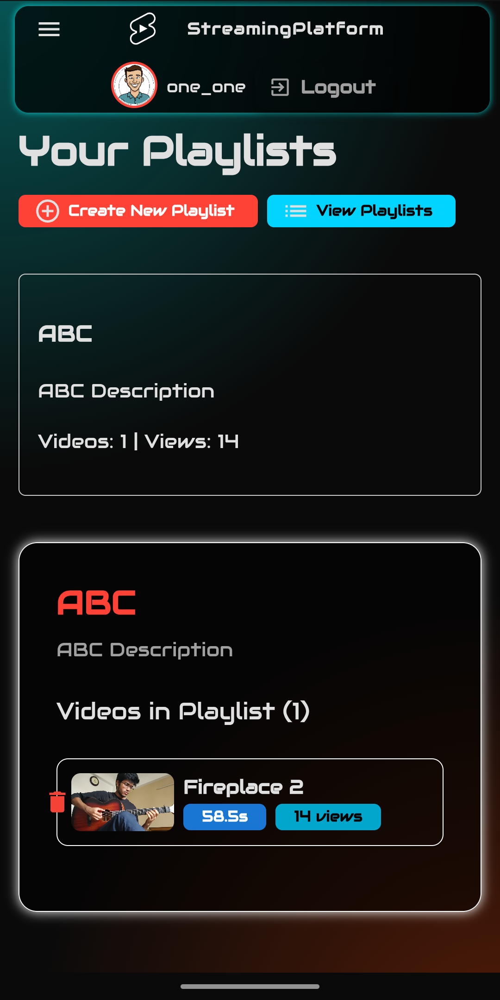

*Optimized for mobile devices, ensuring a seamless viewing and interaction experience on the go.*

### Version 1 Screenshots 🖼️

**Home Page:**
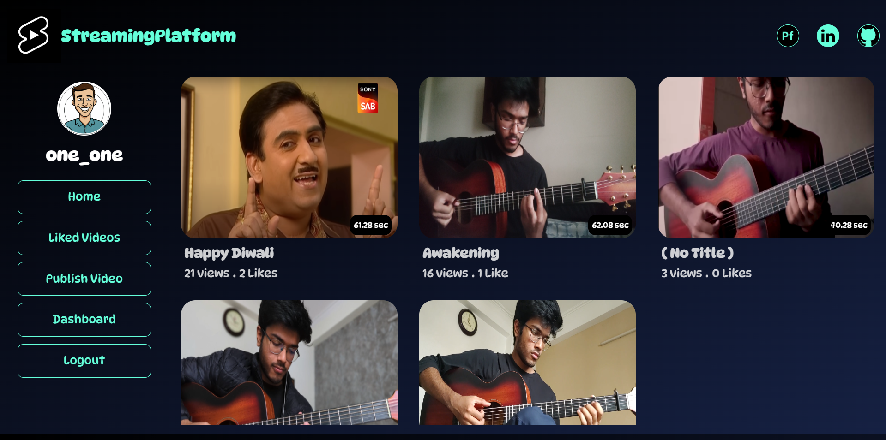
*A glimpse of the initial homepage, featuring various video listings.*

**Liked Videos Page:**
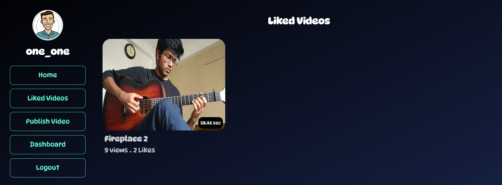
*Access all the videos you've liked from a dedicated section.*

**Upload Video Page:**
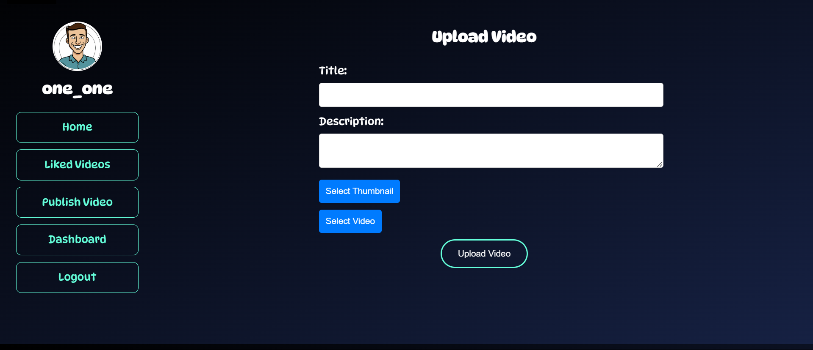
*The interface for securely uploading your video content.*

**Dashboard:**
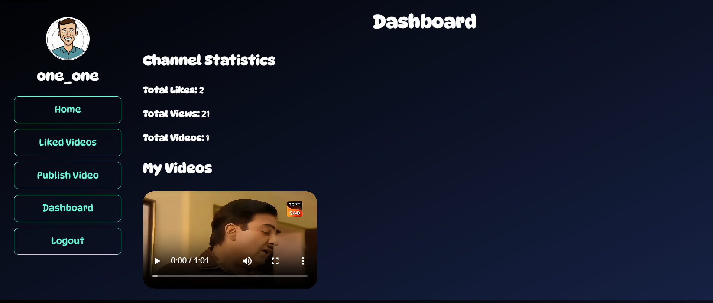
*A comprehensive overview of your channel's key statistics.*

**Mobile View:**

  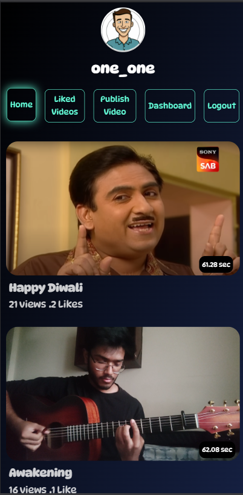

*Optimized for mobile devices, providing a smooth experience wherever you are.*