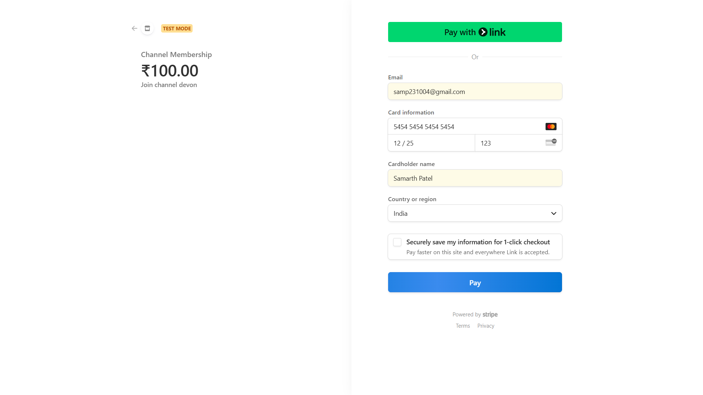

# StreamingPlatform: Where Every Frame Tells a Story 🎬✨

Welcome to **StreamingPlatform**, a dynamic video streaming platform where every frame truly tells a story. Stream your favorite series, films, and documentaries with unmatched visual and audio quality, right at your fingertips. 
Built with the powerful **MERN (MongoDB, Express.js, React, Node.js)** stack, this project showcases robust video management, interactive user engagement features, and a commitment to modern UI/UX principles, evolving through distinct versions.
Now enhanced with **Stripe payment gateway integration**, Users can securely subscribe to premium channels and unlock exclusive content—supporting creators directly through seamless and secure Stripe transactions.

---

## 🚀 Live Demos

Experience StreamingPlatform in action! Dive into the live deployments:

* **Version 2 (Latest - Frontend with Playlists & Subscriptions):**
    🌐 [https://streaming-platform-version-2.vercel.app/](https://streaming-platform-version-2.vercel.app/) 🚀

* **Version 1 (Initial Core Features):**
    🌐 [https://streamingplatform-frontend.onrender.com/](https://streamingplatform-frontend.onrender.com/) ☁️

---

## ✨ Features

StreamingPlatform has evolved significantly. Here's a breakdown of the functionalities across its versions:

### Version 1: Core Streaming Capabilities

* 🔐 **Secure User Authentication:** Enjoy robust user registration and login, ensuring a safe experience.
* 📈 **Dashboard Functionality:** Get insights into your channel's performance with comprehensive statistics, including total views, likes, and uploaded videos.
* 📤 **Dynamic Video Upload:** Easily upload your video content to the platform with secure handling.
* 📺 **Seamless Video Viewing:** Watch videos with a smooth, responsive player for an uninterrupted experience.
* 🗣️ **Interactive Comments System:** Engage directly with content by adding and viewing comments.
* ❤️‍🔥 **Like/Unlike Functionality:** Express your appreciation for videos with a simple click.
* ⭐ **Liked Videos Dashboard:** Quickly access all the videos you've liked from a dedicated section.
* 📝 **Video Publishing/Unpublishing:** Maintain full control over your content's visibility.

### Version 2: Enhanced Engagement & Refined Experience

Building upon Version 1's foundation, this iteration introduces significant enhancements:

* 🎶 **Personalized Playlists:** Create and manage custom video playlists to organize content for your audience or personal viewing.
    * Easily add or remove videos from your playlists.
* ✅ **Channel Subscriptions:** Follow your favorite channels to stay updated with their latest uploads.
    * Effortlessly view and manage your subscriptions.
* 💳 **Paid Channel Memberships (via Stripe):** Support your favorite creators by joining exclusive channels through secure Stripe payments.
    * Integrated Stripe Checkout for seamless and secure transactions.
    * Access members-only videos and exclusive content after successful payment.
    * View and manage your active memberships from your dashboard.
* 🌟 **Redefined UI/UX:** Experience a completely revamped user interface designed for intuitive navigation and an aesthetically pleasing, modern feel.
    * Improved responsiveness across all devices.
    * Enhanced visual feedback and fluid animations for a smoother user journey.

---

## 🛠️ Tech Stack

StreamingPlatform leverages a powerful combination of technologies to deliver a robust and scalable streaming experience.

| Category            | Technologies                                                                                               |
| :------------------ | :--------------------------------------------------------------------------------------------------------- |
| **Frontend** 💻   | **React.js** (Hooks), **Material-UI** (MUI), **Framer Motion**, **Axios**, **Mux Player**, **Vite**, HTML5 / CSS3 / JavaScript |
| **Backend** ⚙️    | **Node.js**, **Express.js**, **MongoDB**, **Mongoose**, **JSON Web Tokens** (JWT), **Bcrypt.js**, **Stripe API (for payment processing and subscriptions)** | 
| **Cloud & Hosting** 🌐 | **Vercel** (Frontend V2), **Render** (Frontend V1 & Backend), **Mux** (Video Streaming API & CDN)          |

---

## 📸 Screenshots

Witness the user interface and key features of StreamingPlatform across its versions.

### <u>Version 2 ✨</u>

### 🎬 Redefined Landing Page: 

*✨ The sleek, redesigned landing page with improved navigation and aesthetics.*

### 🏠 Home Page:  
  
*🎥 The main home feed showcasing various video content.*

### 📺 My Subscriptions Page:  
  
*🔔 View and manage your channel subscriptions effortlessly.*

### 🎵 My Playlists Page:  
  
*📂 Organize and access your personalized video collections.*

### 📤 Upload Video Page:  
  
*🎬 The intuitive interface for uploading new video content to your channel.*

### 📊 Dashboard:
  
*📈 A comprehensive overview of your channel's performance and video analytics.*

### 💳 Stripe Payment Gateway to Join Channel:
 
*🔒 Securely enable viewers to join your premium channel with seamless Stripe integration for paid subscriptions.

### 📱 Mobile View:  

  
  
  

  
*📱 Optimized for mobile devices, ensuring a seamless viewing and interaction experience on the go.*

### <u>Version 1 🖼️</u>

### 🏠 Home Page  
  
*🎞️ A glimpse of the initial homepage, featuring various video listings.*

### ❤️ Liked Videos Page  
  
*👍 Access all the videos you've liked from a dedicated section.*

### 📤 Upload Video Page  
  
*🔒 The interface for securely uploading your video content.*

### 📊 Dashboard  
  
*📈 A comprehensive overview of your channel's key statistics.*

### 📱 Mobile View  

  

  
*📱 Optimized for mobile devices, providing a smooth experience wherever you are.*